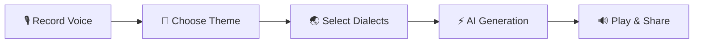
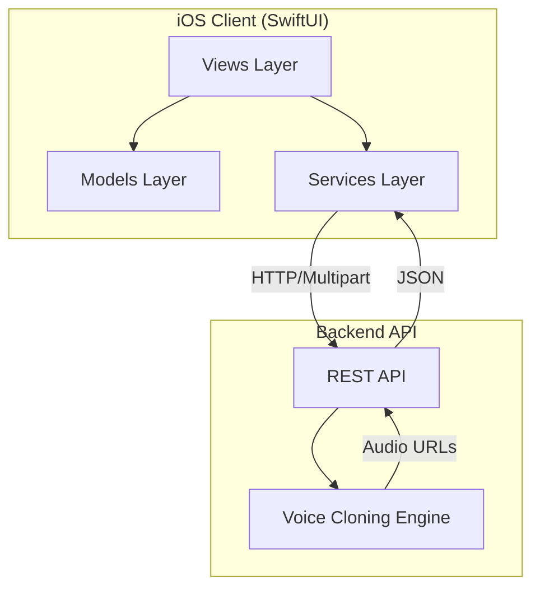

# VoxClone

**Clone your voice with AI. Send personalized voice messages in any dialect.**

VoxClone lets you record a short voice sample, then uses AI voice cloning to generate personalized voice messages in multiple Chinese dialects and international languages — perfect for festivals, birthdays, weddings, gratitude, and everyday greetings.

## Features

- **3-Second Voice Cloning** — Record a brief reading sample; AI learns your unique voice
- **18+ Dialects & Languages** — Mandarin, Cantonese, Sichuanese, Shanghainese, Min Nan, Dongbei, English, Japanese, Korean, Spanish, French, Russian, German and more
- **Scene-Based Generation** — Pre-built themes for Spring Festival, Mid-Autumn, Lantern Festival, Dragon Boat, National Day, birthdays, and custom messages
- **Real-Time Waveform** — Visual audio feedback while recording
- **One-Tap Sharing** — Share generated voice messages directly to WeChat, iMessage, and other platforms
- **Multi-Dialect Output** — Generate the same message in multiple dialects simultaneously

## How It Works



| Step | Description |
|------|-------------|
| **1. Record** | Read a short prompt aloud (~10 seconds). The AI captures your vocal characteristics. |
| **2. Theme** | Pick a festival, occasion, or write a custom message. |
| **3. Dialects** | Choose one or more target dialects/languages for output. |
| **4. Generate** | AI clones your voice and synthesizes speech in each selected dialect. |
| **5. Share** | Preview results and share via social platforms. |

## Supported Dialects & Languages

| Category | Languages |
|----------|-----------|
| **Chinese Dialects** | Mandarin, Cantonese, Sichuanese, Dongbei, Shanghainese, Min Nan |
| **International** | English, Japanese, Korean, Spanish, French, Russian, German |

## Architecture



### Project Structure

```
DialectBlessing/
├── Models/
│   ├── Dialect          — Dialect & language definitions
│   ├── Festival         — Festival/occasion presets
│   └── GreetingTask     — Generation task & result models
├── Views/
│   ├── RecordingView    — Voice recording with waveform
│   ├── ThemeSelectionView — Festival & custom text picker
│   ├── DialectSelectionView — Multi-dialect selector
│   ├── ProcessingView   — Generation progress indicator
│   ├── ResultView       — Playback & sharing
│   └── Components/
│       ├── WaveformView     — Real-time audio waveform
│       ├── AudioPlayerView  — Audio playback controls
│       └── StepIndicator    — Step progress bar
└── Services/
    ├── APIService           — Backend API client
    ├── AudioRecorderService — Microphone recording
    ├── AudioPlayerService   — Audio playback
    └── ShareService         — Social sharing
```

## Requirements

| Requirement | Version |
|-------------|---------|
| iOS | 17.0+ |
| Xcode | 15.0+ |
| Swift | 5.9+ |

## Getting Started

1. Clone the repository
2. Open `DialectBlessing.xcodeproj` in Xcode
3. Build and run on a simulator or device

## Roadmap

- [ ] Backend voice cloning API (CosyVoice3 integration)
- [ ] More Chinese dialects (Hakka, Wenzhou, Changsha, etc.)
- [ ] Voice profile saving — clone once, use forever
- [ ] Audio greeting cards with background music
- [ ] Android client
- [ ] WeChat Mini Program

## License

All rights reserved.
